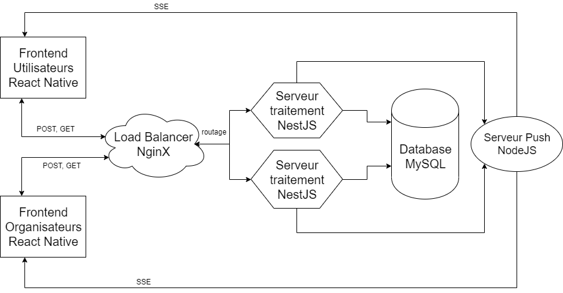
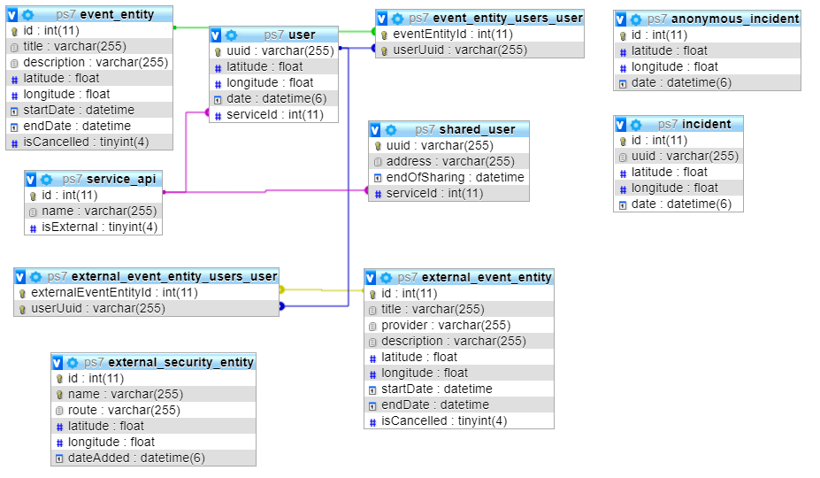

# Polympic PS7 project 
[](https://travis-ci.com/PNS-PS7and8/PNS-PS7-19-20-pns-ps7-19-20-al2)

## Overview

Polympic is a mobile app that allow users to see events near them on a map. The app provides an interface for organizers (administrators) to manage events and see users positions in real time.

[NestJS](https://nestjs.com/) is used for the server/backend side part

[MySql](https://www.mysql.com/fr/) is used for the database

[React Native](https://facebook.github.io/react-native/) is used for the client/frontend side part

[Docker](https://www.docker.com/) is used to deploy load balancer and servers

[NGINX](https://www.nginx.com/) as a load balancer

[Gatling](https://gatling.io/), [Locust](https://locust.io/) and [Artillery](https://artillery.io/) are used for load/stress tests

[Travis](https://travis-ci.org/) as a continuous integration tool

[Swagger](https://docs.nestjs.com/recipes/swagger) to document api

## Quick Start

### Start Front-end (React Native App)

Go to the front folder then edit the config.js and put your ip in the IP variable. Then run this commands in two different terminals
```bash
# launch the local server
$ npm run start
```
```bash
# build the android app on your usb linked phone
$ npm run android
```

There is also a release app available [here](./releases/app-release.apk) if you only want to see the view (and don't want to run npm run android). Since the server ip is not the same as your local server you won't be able to load data with the release app

### Start Back-end (NginX, NestJS & MySQL)

(Docker required, check **"Setup"** section in _Backend Documentation_)

```bash
$ docker-compose up --build --scale nest=2
```

## Documentation
<details>
  <summary>Front-end</summary>
  
### Start React App (Android only)

Go on the same Wi-Fi network on your PC and phone. Go to the front folder then edit the config.js and put your ip in the IP variable. On your PC open a terminal in /front/ and type the next command to run the local server
```bash
$ npm run start
```

Then launch the next command line in order to build an apk file that will be installed on the usb connected phone :
```bash
$ npm run android
```

To build an IOS app some configuration that we didn't made needs to be done. So to install on IOS please refer to the official doc.

On your phone, open the app (dismiss any error/warning), shake it until the debug menu appears and then click on 'Settings', then click on 'Debug server host & port for device and past your PC local IP address like
```
192.168.X.X:8081
```

  ### Bugs React Native
- If regex bug :
	Change file  "node_modules/metro-config/src/defaults/blacklist.js"
		```javascript
		var sharedBlacklist = [
		  /node_modules[\/\\]react[\/\\]dist[\/\\].*/,
		  /website\/node_modules\/.*/,
    /heapCapture\/bundle\.js/,
		  /.*\/__tests__\/.*/
		];
		```
		
- If error path SDK ANDROID :
	Install Android Studio (or the sdk via intelliJ) then add the variable in the path with the link to the sdk
	%AppData%\Local\Android\Sdk 


- Si licence bug :
	Accept all when launching %AppData%\Local\Android\Sdk\tools\bin\sdkmanager.bat --licenses

</details>

<details>
  <summary>Back-end</summary>
  
## Installation

npm and docker are required

Python 3 is required for stress tests with Locust

```bash
# install dependencies on both front & back folders
$ npm install

# locust for stress tests
$ pip3 install locustio
```

## Running the backend

```bash
# With Docker for 2 server
$ docker-compose up --build --scale nest=2

# development
$ npm run start

# watch mode
$ npm run start:dev

# production mode
$ npm run start:prod
```

## Test

```bash
# all tests
$ npm run test

# all test with coverage
$ npm run test:cov

# Stress test with Locust (used for the last verison)
## stress test for internal users
$ npm run test:locust-user
## stress test for external
$ npm run test:locust-ext_user  users

# gatling test
$ mvn clean package
$ mvn galting:test

# artillery test (for 1.0.0 release)
$ npm install artillery -g
$ npm run test:socket
```

## API documentation

```bash
# Route & Schema doc (with Swagger)
http://localhost:80/api
```

## Back-end architecture


## Database architecture


</details>

<details>
  <summary>Publisher server</summary>
  
# Publisher server
## Description

The aim of this server is to redirect data to the organizers and the users

If a user is **created** or a user **update** his position then this update will be transmitted by the responsible server to the pusblisher server and the publisher server will send his new information to all organizers.

Furthemore, if an event is **created** or **updated**, this event will be transmitted to all users and organizers as well.

This connection between any NestJs server and the publisher server is an **SSE connection**. (All NestJs server -> publisher server)

And the connection between the organizers/users and the publisher is also a **SSE connection**. (Publisher server -> organizers/users)

## Installation

npm is required

```bash
# nstall dependencies
$ npm install
```

## Running the app

```bash
# With Docker for 2 server
$ docker-compose up --build --scale nest=2

# development
$ npm run start
```

### Instantiate the server

Now that your server is launch you can connect it to all NestJs servers which are currently running. 

To that you must to do a specific request :

**POST** : http://**hostname**:**port**/intantiate

```bash
# default hostname value
hostname : localhost

# default port value
port : 9428
```

And past in the body an array of all hostnames and ports of connected servers

**BODY**
```bash
[
    #in docker for 2 nest server launched
    {
        hostname: "nest",
        port: "3000",
        quantity: 2
    },
    #for simple server which run outside of docker
    {
        hostname: "198.168.0.0",
        port: "3000"
    }
]
```
## Connect users and organizers

There are specific routes for users and organizers

An organiser can instantiate a sse connection on this route :

**GET** : http://**hostname**:**port**/organizer/init_sse_connection

An user can instantiate a sse connection on this route :

**GET** : http://**hostname**:**port**/user/init_sse_connection
</details>
